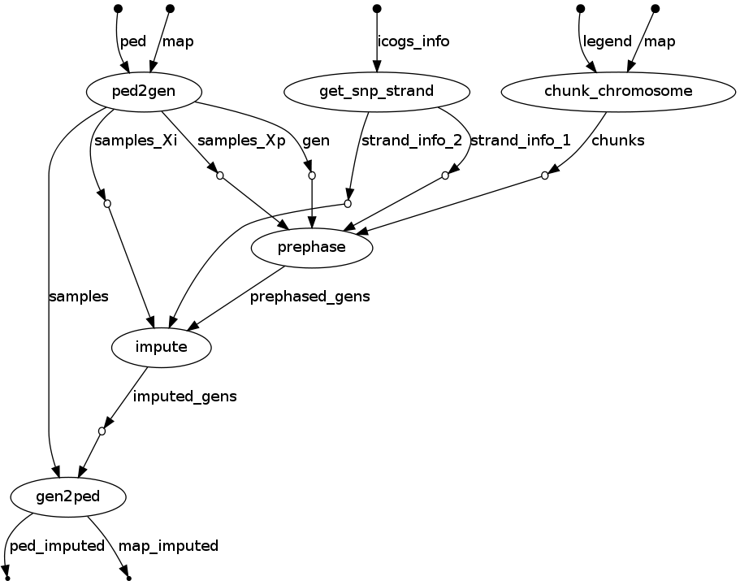

# GENESIS

Christine provided me with the necessary files to run SConES on the genesis data. I stored the data in ~/genewa/data/genesis. It includes:

- Genotype information (Genesis.ped & Genesis.map) of 2,566 participants, all of them of European origin. Around half of them are cases (BRCA patients, BRCA1/2 negatives AND have an affected sister) and the other half controls (coworkers). SNPs were assigned to a gene if they are between the start and the end of the gene (ie include introns and exons). These files contain some missing values; also, some of the variants involve insertions deletions. Its in format 0-1-2-3-4, for NA-A-C-G-T.
- PPI information from BioGRID (BIOGRID-ORGANISM-Homo_sapiens-3.4.138.tab.txt)
- All the tested variants in the ICOGS microarray (icogs_snp_list.csv). This microarray includes a set of 211,155 polymorphisms in 13,113 cancer-related genes.
- Gene-to-SNP mapping (gene2snp.hg19)
- Genes and their genomic position (glist-hg19)

## Data processing

We prepared the PED files for SConES using [this](../pipelines/imputation/prepare_ped.sh) pipeline.

### Imputation

Ideally, data for biomarker discovery would have no missing values nor genotyping errors. However, that is not always the case. Genotyping errors are complicated to deal with. Fortunately, the community effort in unraveling human variability allows us to deal with missing values. Imputation is the statistical inference of missing genotypes based on known linkage disequilibrium with other non-missing variants. gin cannot deal with missing values, so an imputation step is crucial. This step also provoked the removal of indels.

We used IMPUTE2 for the inference of missing genotypes. The genotypes were inferred from the 1000Genome Project (1000GP), Phase 3 genotypes. Given that the GENESIS cohort is European, we are particularly interested in using the samples of European origin in 1000GP. Nonetheless, the IMPUTE2 documentation recommends against constraining to the population of interest, as there might be hidden population structure where other genotypes might be relevant. In consequence, we provided IMPUTE2 with the full 1000GP dataset, and asked it to select the 503 most relevant samples (where 503 is the number of European samples in 100GP).

Imputation is a computationally expensive step, that we solved through intensive parallelization. We divided each of the chromosomes in chunks of 5 megabases. Each of them was imputed separately before being merged again to recover the dataset. IMPUTE2 was able to impute all the variants surveyed by iCOGS, which allowed to use all the SNPs and samples in successive stages.

### QC

Population structure refers to the situation when a population contains several, genetically distinct, subgroups (as opposed to homogeneity). In genetic studies, when this stratification causes different allele frequencies between cases and controls due to ancestry differences, spurious associations can appear. Fortunately, there are methods to detect and correct population structure in a dataset.

In presence of population structure, all tests in a GWAS are multiplied by a genomic inflation factor λ, calculated as

$$ λ = median(\chi^2)/0.456 $$

High values of λ (λ >> 1), indicate deviation from the theoretical distribution and, in consequence, population structure. Once detected, population structure can be corrected:

$$ \chi^2_{adjusted} = \chi^2/\lambda $$

EIGENSTRAT is a method to detect and correct for population stratification. First it infers continuous axis of genetic variation by applying a PCA to the genotype data. Then it adjusts through linear regressions genotypes and phenotypes attributable to ancestry along each axis. Lastly, it computes association statistics using ancestry-adjusted genotypes and phenotypes.

Using EIGENSTRAT on GENESIS we confirmed that there is no confounding effect due to population structure. [Here](genesis_exploration_1.ipynb) we show that the two principal components do not allow to split the data in cases and controls, although we can assess the presence of structure. If there was this confounding effect, the largest sources of variance would be related to it. Additionally, the estimated λ = 1.048 is close to 1. As we see [here](genesis_exploration_1.ipynb), the observed distribution of χ2 follows the expected distribution.
