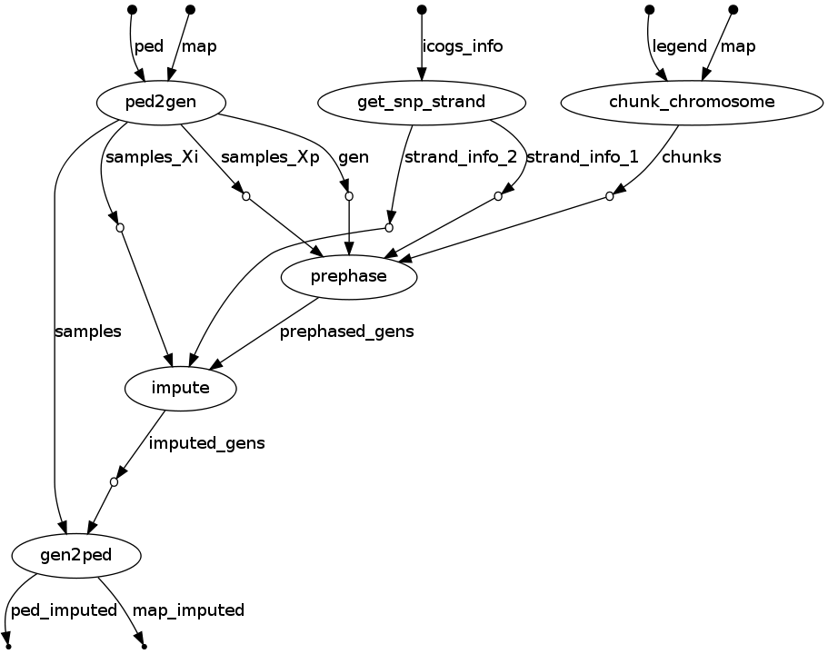

# GENESIS

Christine provided me with the necessary files to run SConES on the genesis data. I stored the data in ~/genewa/data/genesis. It includes:

- Genotype information (Genesis.ped & Genesis.map) of 2,566 participants, all of them of European origin. Around half of them are cases (BRCA patients, BRCA1/2 negatives AND have an affected sister) and the other half controls (coworkers). SNPs were assigned to a gene if they are between the start and the end of the gene (ie include introns and exons). These files contain some missing values; also, some of the variants involve insertions deletions. Its in format 0-1-2-3-4, for NA-A-C-G-T.
- PPI information from BioGRID (BIOGRID-ORGANISM-Homo_sapiens-3.4.138.tab.txt)
- All the tested variants in the ICOGS microarray (icogs_snp_list.csv). This microarray includes a set of 211,155 polymorphisms in 13,113 cancer-related genes.
- Gene-to-SNP mapping (gene2snp.hg19)
- Genes and their genomic position (glist-hg19)

## Data processing

We prepared the PED files for SConES using [this](../pipelines/imputation/prepare_ped.sh) pipeline.

### Imputation
Given the current inability of SConES to handle missing values, we imputed the missing values using data from 1k genomes. The process is done chromosome by chromosome. The general outlook is the following:

This step included the removal of indels and the converstion to ATCG format.

### QC

Christine already performed a QC on the data. Nonetheless, we looked for population structure in the data. There seems to be no hidden population structure (genomic inflation factor λ = 1.048, first 2 PC available [here](genesis_exploration_1.ipynb).
