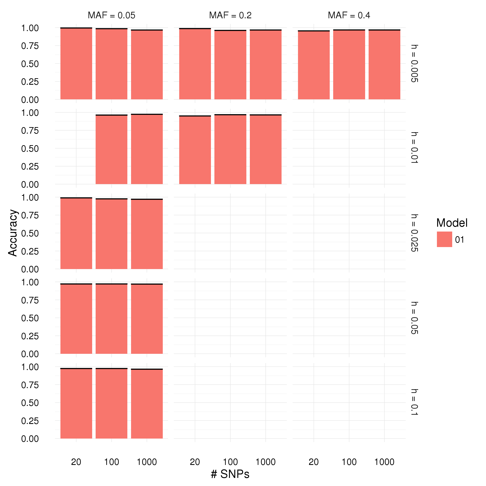
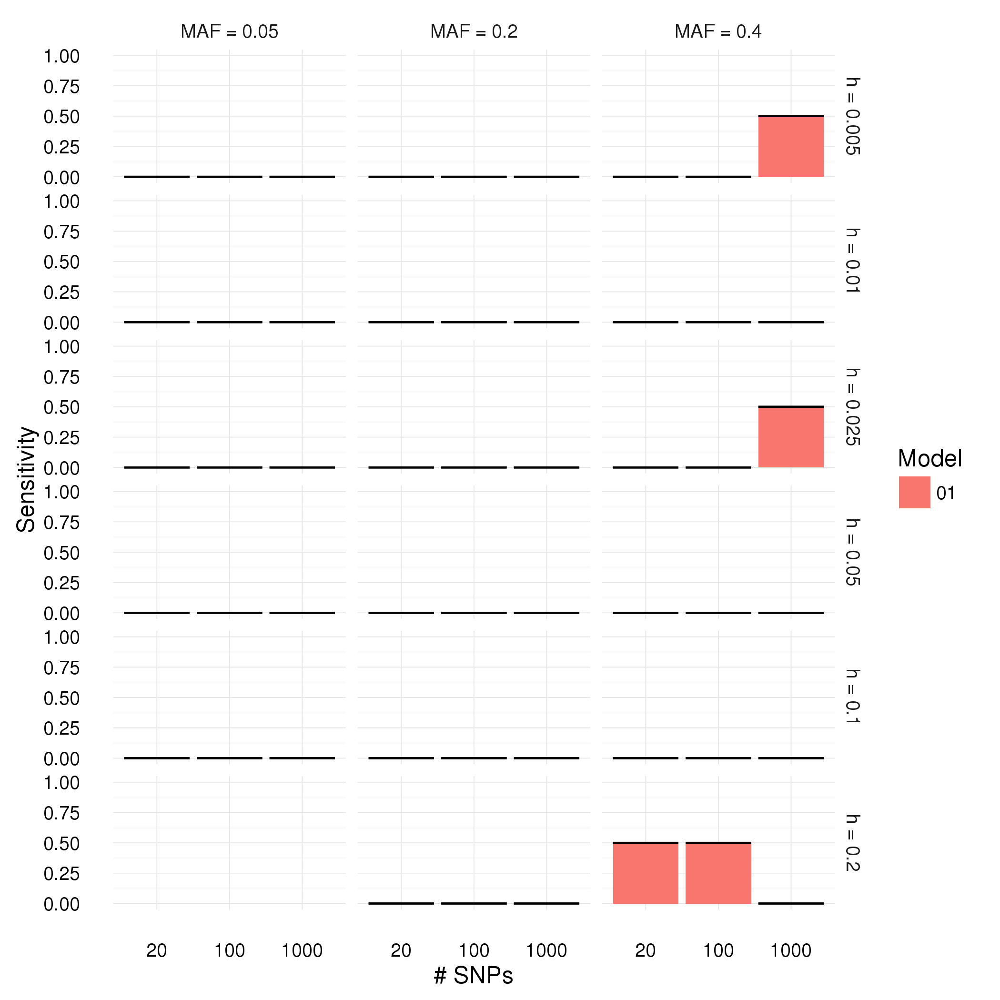
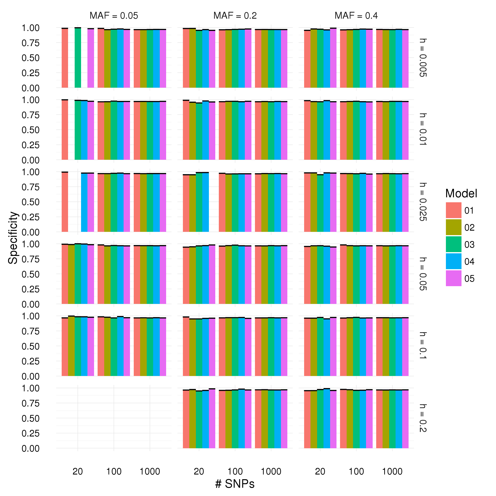

We want to compile a list of existing tools to detect epistasis. Firstly, we want to test the performance of existing tools. Not only under the lenses of accuracy and type I errors, but also of **stability** ie how robust are the results. In order to do this, we will sample our simulated data and compare the results (eg correlation between the p-values among the different runs). Secondly, we want to test how different simulation settings affect the outcome. For example, what are the lower boundaries of incidence to detect epistasis.

# List of tools for disease (case/control)

Curated collection of tools compiled from [several](https://www.ncbi.nlm.nih.gov/pmc/articles/PMC4564769/) [papers](http://www.nature.com/nrg/journal/v15/n11/full/nrg3747.html) and [OMICtools](https://omictools.com/epistasis-detection-category). Only tools still accessible are kept. There is yet another [review](http://bib.oxfordjournals.org/content/17/3/368.abstract) that uses most of the tools we intended to use. Also it is recent, so explains the latest challenges in the field.

## Exhaustive search

* Regression-based methods: Methods based on logistic regression. Time consuming and low powered.

  * **[PLINK epistasis-module](http://pngu.mgh.harvard.edu/~purcell/plink/epi.shtml)**
  * [BOOST](http://bioinformatics.ust.hk/BOOST.html). *Download site is recognised as malware by our proxy. His email server rejects our emails.*

* LD- and haplotype-based methods: They check if the joint co-occurrence is different between cases and controls. Faster and higher powered. Works well for *unlinked* loci (eg separate chromosomes) in *rare* diseases.

  * [SIXPAC](http://www.cs.columbia.edu/~snehitp/sixpac/). *Unclear problem with input format, and lack of documentation.*

## Non-exhaustive search

* Artificial intelligence algorithms: use classifiers for data reduction and/or feature selection to reduce both the computational burden and the statistical burden of an exhaustive search.

  * **[MDR](https://sourceforge.net/projects/mdr/)**
  * Random forest
    * [SNPInterForest](https://gwas.biosciencedbc.jp/SNPInterForest/index.html)
    * **[GWGGI](https://github.com/changshuaiwei/gwggi)**
  * Bayesian network-based
    * **[BEAM](http://www.people.fas.harvard.edu/%7Ejunliu/BEAM/)**: reference among Bayesian-based classifiers. Needed to compile the Linux version.
    * EpiBN: *apparently outperforms BEAM. However, we couldn't find any download links on the paper or on the internet.*
    * DASSO-MB: *also outperforms BEAM and is nowhere to be found.*
  * Ant colony optimization
    * [MACOED](http://www.csbio.sjtu.edu.cn/bioinf/MACOED/): *available for Windows only.*
    * **[AntEpiSeeker](https://github.com/wyp1125/AntEpiSeeker)**
  * [SNPruler](http://bioinformatics.ust.hk/Software.html)
  * [ranger](https://github.com/imbs-hl/ranger)

* Data-filtering methods: hypothesis-driven approaches aim to select a subset of SNPs for interaction tests on the basis of existing biological knowledge (for example, databases of pathways and protein–protein interactions), statistical features (for example, marginal effects and SNP genotype frequencies) or fast algorithms.

  * **[ReliefF series](https://code.google.com/archive/p/ensemble-of-filters/)**: TuRF-E + MDR.
  * [SNPHarvester](http://bioinformatics.ust.hk/SNPHarvester.html)
  * [EDCF](http://www.cs.ucr.edu/~minzhux/EDCF.zip)

```bash
rm populations/gametes/parameters_long.txt

for repNo in $(seq -f "%03g" 1 100)
do
  for modelNo in $(seq -f "%02g" 1 10)
  do
    for h in "005" "01" "025" "05" "1" "2"
    do
    	for maf in "05" "2" "4"
    	do
        for N in "1000" "100" "20"
        do
          echo $h  $maf  $N  $modelNo  $repNo >>populations/gametes/parameters_long.txt
        done
      done
    done
  done
done

qsub -t 1-54000 -q all.q -e populations/gametes/logs -o populations/gametes/logs scripts/gametesBenchmark.sh

```

# Evaluation of tools

## PLINK

PLINK results are straightforward: a test is conducted on every pair of SNPs and a p-value is produced. Picking a threshold of 0.05 we call the positives and the negatives. **Correction for multiple testing required?** The script is at:

```shell
scripts/plink_summary.R gametes
```







## MDR

```shell
scripts/mdr_summary.R gametes
```


